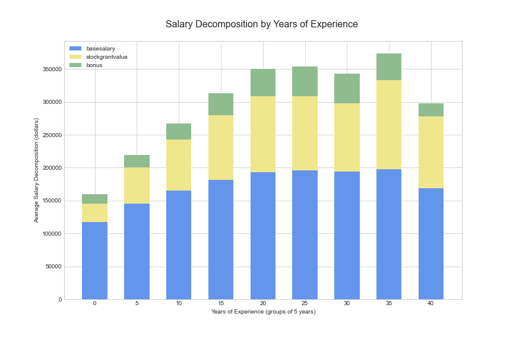
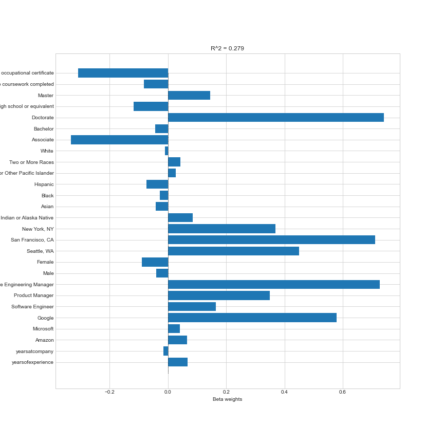

# Analysis of Full-time STEM Compensation

## Table of contents
- [Introduction](#introduction)
- [Methods Used](#methods-used)
- [Technologies](#technologies)
- [Project Description](#project-description)
- [Project Results](#project-results)
- [Installation](#installation)

## Introduction
[(Back to top)](#table-of-contents)
 

As a current M.S. in Data Science student at NYU, I'm looking to work as a full-time data scientist after I graduate. I think it's important for me and other job seekers to more fully understand compensation in the STEM field. However, it is not entirely clear which specific factors are driving STEM compensations. 

In this project, I answer the following questions: 
+ Which STEM roles are the most well-paid?
+ Are graduate degrees such as Master’s degrees and Doctorates important driving factors of salary compensation? 
+ Do years of experience directly contribute to the amount of compensation? 
+ Lastly, which specific factors are the major driving forces of salary in the STEM fields? 
  
In this report, I will explore possible answers to these questions and more by analyzing data from levels.fyi, an online site that offers services in salary negotiation.

## Methods Used
[(Back to top)](#table-of-contents)
+ Data Collection
+ Data Cleaning
+ Exploratory Data Analysis
+ Correlation Analysis
+ Data Visualization
+ Multiple Linear Regression

## Technologies
[(Back to top)](#table-of-contents)
+ Python
+ NumPy 
+ Pandas
+ Datetime
+ Matplotlib
+ Seaborn
+ Scipy
+ Sklearn
+ Requests

## Project Description
[(Back to top)](#table-of-contents)
 

The important features of dataset included:
+ Years of experience, Years at company
+ Total yearly compensation, Base salary, Bonus, Stock grant value
+ Gender, Location, Other details

  
The project tasks involved:
 
 

+ Loading .json file containing compensation data from levels.fyi into a pandas DataFrame using the requests library
+ Cleaning the data by using pandas
+ Conducting an exploratory data analysis (EDA) to investigate factors impacting STEM Compensation
+ Feature engineering by adding race and education from the 'other details' column and creating dummy columns for the categorical variables
+ To read more about the data cleaning and feature engineering process,  view <a href="https://github.com/jw7383/STEM-Compensation-Analysis/blob/main/STEM_Compensation_Analysis.ipynb" target="_blank">full code here</a> and the <a href="https://github.com/jw7383/STEM-Compensation-Analysis/blob/main/Report.pdf" target="_blank">full report here. </a>
+ Implementing a Multiple Regression Analysis to see the most important factors that determine 'total yearly compensation'

## Project Results
[(Back to top)](#table-of-contents)
 

To explore the distribution of our numerical variables, I generated a histogram for each of the columns.

All of our columns were skewed to the right, except for, interestingly, base salary. A possible explanation could be that our data is self-reported, which means the data was not randomly obtained, so many of the users using levels.fyi have an average salary around $140,000.

Next, I created a heatmap to show the correlation matrix between the numerical variables. The target variable ‘total yearly compensation’ is most correlated with ‘stock grant
value’, meaning that ‘stock grant value’ could be the leading indicator when measuring total salary. This could be explained by the fact that those with large stock grant values are probably very high executives who have very large overal compmensation. 'Total yearly compensation’ is naturally also correlated with ‘base salary’ (r = 0.77)
and ‘bonus’ (r = 0.51). It’s also worth noting that ‘total yearly compensation’ has a stronger correlation with ‘years of experience’ (r = 0.42) than with ’years at company’ (r = 0.16),.

The next three plots show how different factors influence the three types of compensation.

First, I grouped ‘years of experience’ into buckets of 5-year spans and plotted the average salary in each group. Before reaching 40 years of experience, all three parts of
‘total yearly compensation’ -- ’base salary', ‘bonus’, and ‘stock grant value’ -- increases as ‘years of experience’ increase. The ‘total yearly compensation’ reaches its peak for those with 35 to 40 years of experience at around $380,000, which is more than twice for beginners with 0 to 5 years of experience at around $160,000.

Second, I plotted the average salary for each ‘title’ and sorted them by ascending order of ‘total yearly compensation’. Software Engineering Manager takes the lead by earning around $360,000, followed by Product Manager ($260,000) and Technical Program Manager ($240,000). The ‘base salary’ does not vary much for different positions, but the figure clearly shows that manager roles have higher ‘stock grant value’ than other roles, and that sales roles have higher ‘bonus’ than other roles.

Lastly, I plotted the average salary for each ‘education’ category and sorted them by ascending order of ‘total yearly compensation’. In general, the higher the degree obtained, the higher for all three parts of ‘total yearly compensation’. The ‘total yearly compensation’ is around $290,000 for Doctorate degree holders, $220,000 for Master’s degree holders, and $180,000 for Bachelor’s degree holders. However, employees with a high school degree or equivalent and those who only completed some college coursework receive a higher ‘total yearly compensation’ of around $220,000 than Bachelor’s degree holders. This could again possibly be attributed to the fact that our data comes from those already in the STEM field, so those who did not finish their degree or only have a high school degree could be individuals who were recruited early by companies for already being top candidates. There could also be noise as there is a limited amount of data for those variables.

Finally, since I was interested in knowing the most important factors that determine ‘total yearly compensation’, I decided to implement a multiple regression analysis. To do so, I first formatted our data and implemented some feature engineering so that I could train the model. Next, I implemented scikit-learn’s train-test-split function to randomly partition both the predictors and outcome variable using an 80/20 split. With the training subset I fit a multiple regression model, which I then used to make predictions using the testing subset of our predictors matrix. Below is a plot of the beta coefficient for each of our predictors so that I could visually assess the importance of each factor.

The larger the coefficient, the most important the factor is in determining total yearly compensation. Interestingly, it appears that the 4 most important factors are having a Ph.D., working San Francisco, being a software engineering manager, and working at Google.

View the full report <a href="https://github.com/jw7383/STEM-Compensation-Analysis/blob/main/Report.pdf" target="_blank"> here.</a>

## Installation
[(Back to top)](#table-of-contents)
+ Clone this repo <a href="https://docs.github.com/en/free-pro-team@latest/github/creating-cloning-and-archiving-repositories/cloning-a-repository" target="_blank">(for help see this tutorial).</a>
+ The full code is stored in this repository. <a href="https://github.com/jw7383/STEM-Compensation-Analysis/blob/main/STEM_Compensation_Analysis.ipynb" target="_blank">Click here for notebook.</a>
